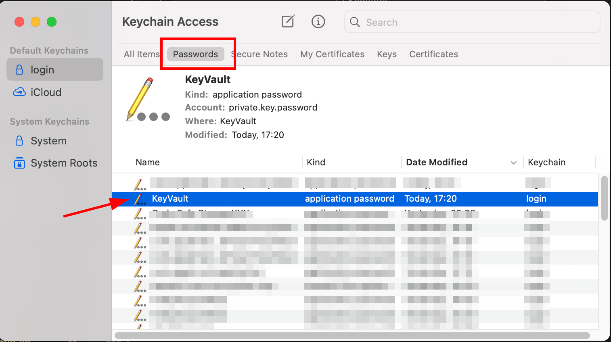

# KeyVault

KeyVault simplifies secure secret management. It stores encrypted key-value pairs for API keys, passwords, and other sensitive information in a text file format. This allows for easy backups and integration with environment variables. KeyVault even offers convenient access through OS keychain and clipboard, making it a versatile solution for keeping your secrets safe and readily available.  

## For the Impatient
If you are very impatient to try it out, use the following 30-seconds guide to install on your machine!  It will generate a short password for the generated private keys. 

```
git clone https://github.com/barrychum/keyvault

cd keyvault/scripts

export PATH=$PATH:$(pwd)

config-keyvault.sh --demo

set-keyvalue.sh key01 Key_secret

get-keyvalue.sh key01 --display
```

## Demo

Installation demo  

  
Basic operations demo  


## Features

- **Encrypt Secrets Using PKI**: Secure your secrets using public-key infrastructure. Supports up to 4096-bit RSA keys for future-proof security.
- **Password-Protected Private Key**: Supports password protection on private keys, functioning similarly to 2FA for decryption.
- **macOS Keychain Integration**: Save your private key password in macOS Keychain to avoid password fatigue.
- **User-Friendly Secret Management**: Integrate with `fzf` for easy and quick selection of keys, using system-level OpenSSL for decryption.
- **Secure by OS**: All critical encryption and decryption processes are handled by the OS's OpenSSL. No third-party tools are used. `fzf` is only used to retrieve key.
- **Automatic Clipboard Clean Up**: Automatically clears the clipboard after use to enhance security.
- **Easy Integration with Scripts**: This is particular useful to put API keys in your environment and access the secret in scripts.  A time-based One Time Password module is included in this repo for integration demo.

## Why Use PKI for KeyVault?

KeyVault leverages Public Key Infrastructure (PKI) to manage and encrypt your secrets, offering several advantages over traditional key managers that use symmetric encryption:

### Enhanced Security

- **Asymmetric Encryption**: PKI uses asymmetric encryption, where the public key encrypts data and the private key decrypts it, reducing the risk of exposing the private key used for decryption.

### Reduced Risk of Key Exposure

- **Encrypted Private Keys**: Private keys in PKI can be encrypted with a password, reducing the risk of key exposure. The key is only decrypted in memory when needed and never stored in plaintext on disk.
- **Automated Key Handling**: The process of decrypting the private key and using it is integrated, minimizing the chances of human error or insecure handling of keys.

### Avoid Separate Process for Symmetric Key Encryption

- **Temporary Exposure**: There may be a brief period when the symmetric key is exposed in plaintext during the encryption or decryption process, especially if the key is written to disk or stored in memory insecurely.

## Getting Started

### Repository Structure
```
KeyVault/
│
├── bash/
│   └── # Bash scripts
├── pwsh/
│   └── # Powershell scripts
├── totp/
│   └── src # Time-based one time password helper
├── LICENSE
└── README.md
```

- `scripts/`: bash scripts.
- `README.md`: This file.
- `LICENSE`: For license information.

### Prerequisites

- OpenSSL
- fzf (optional: for user-friendly selection of keys from the encrypted database)
- macOS (for Keychain integration)
- Windows (for Credential Manager integration)

### Installation

Clone the repository:
```
git clone https://github.com/barrychum/KeyVault.git
cd KeyVault/scripts

# Optional to add to PATH.
# You can also copy the scripts to any folder on the PATH.
export PATH=$PATH:$(pwd)
```

Install fzf (optional):
You don't need to install this tool if you only use the CLI. This tool is required if you want to use a menu to select the key. Strongly recommended.
```
brew install fzf
```

### Configuration

Run the configuration script to set up KeyVault:
```
config-keyvault.sh
```

This script will create the KeyVault folders and generate keys. If you choose to generate private keys with a password, the same password is used for all private keys generated.

```
$HOME/.config/keyvault/
│
├── keys/        # Store the keys for encryption and decryption.
│   └── *.pem 
├── keyvault.db  # The key-value pair secret file
└── config.ini   # Configuration file used by scripts
```

**IMPORTANT**: Keep your private key safe with backup.  You cannot **DECRYPT** without the private key, and other peole can decrypt your data if they have your private key and **IF THE KEY USED IS NOT PASSWORD PROTECTED.** Adding a password to protect the private key is recommended.

### Usage

1. **Encrypt a Secret**:
   ```
   set-keyvalue.sh "my_secret_key" "my_secret_value"

   # To get help, just run the script without parameters
   set-keyvalue.sh
   ```

   Usage: `set-keyvalue.sh <key> <value> [--protected | -p] [--key=2048 | -k=2048] [--key=3072 | -k=3072] [--key=4096 | -k=4096]`

   Default encryption uses 2048-bit without password-protected keys. To add a secret using 4096-bit with password-protected keys:
   ```
   set-keyvalue.sh "my_secret_key" "my_secret_value" -p -k=4096
   ```

   If the key you provided already exists, the script will prompt you to confirm if you want to overwrite the existing value.

2. **Retrieve a Secret**:
   ```
   get-keyvalue.sh "my_secret_key"
   ```
   This script retrieves secrets from the vault. It will determine the key length and whether to use password-protected keys. If a password-protected key is used, the script will try to access the keychain. If the keychain is locked, it will ask you to unlock it using any supported methods such as password or biometrics.

   If you have not saved the private key password in the keychain, the script will ask you for it on the fly and use it for decryption.

   Please refer to the **Add password to keychain** section below to add a password to the keychain.

3. **Copy Secret to Clipboard**:
   ```
   copy-keyvalue.sh 
   ```
   The `copy-keyvalue.sh` script will show a menu of all keys in KeyVault using `fzf`. `fzf` uses fuzzy search, allowing you to find your key quickly. Once you select the key, `fzf` will only pass the key back to the script, which will retrieve the encrypted value from the vault and pass it to OpenSSL for decryption. The decrypted value is placed in the OS clipboard and will be cleared after 30 seconds.

4. **Add Password to Keychain**:
   ```
   set-mackeychain.sh
   ```
   Just run this script and it will create a generic password entry in the OS keychain.
   
   

5. **Integration in scripts**:

   A bash-like shell example:  
   ```
   VARIABLE=$(get-keyvalue.sh "keyname")
   ```
   If the key pair is password protected, please ensure the password has been added to the keychain.

   **Integration example**:

   The folder totp contains a script to generate a One Time Password (OTP) which you can use to login online systems.  A One Time Password is generated from a secret during the registion of the 2FA, which is usually in the form of a QR code.  Most systems provide an alternate way by providing the secret to you to enter manually.  Save the secret as a key value in KeyVault. To generate a OTP, run the otp.sh in the script directory and select the OTP secret.  Please copy totp/src/get-otp.sh to a folder in the PATH.

   ```
   otp.sh
   ```


## License

This project is licensed under the MIT License.

## Acknowledgements

- OpenSSL for encryption functionalities
- macOS Keychain for secure password storage
- `fzf` for the command-line fuzzy finder
